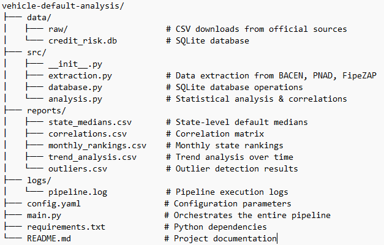

# Credit Risk Vehicle Loans Analysis - Brazil

## 📋 Executive Summary

A comprehensive **credit risk analysis** project for vehicle loans (*Financiamento de Veículos*) in Brazil, integrating official data from **BACEN (SCR)**, **IBGE (PNAD Contínua)**, and **FipeZAP**. The pipeline evaluates how macroeconomic factors impact retail credit performance across all **27 Brazilian states**.

### Key Features

- ✅ **Automated data extraction** from official Brazilian sources
- ✅ **State-level delinquency ranking** (monthly stratified analysis)
- ✅ **Correlation analysis** with macroeconomic indicators
- ✅ **Trend analysis** over time (2024–2026)
- ✅ **Outlier detection** using statistical methods
- ✅ **SQLite database** for structured data storage
- ✅ **CSV export** for all analysis results

### Data Sources

| Source | Data | Period |
|--------|------|--------|
| **BACEN - SCR** | Vehicle loan portfolio & delinquency by state | Jun 2026 |
| **IBGE - PNAD** | Median income, unemployment, Gini coefficient | 2025 Q1 |
| **FipeZAP** | Real estate prices, rent variation | Jul 2026 |

## 📊 Key Results

### 1. Vehicle Loan Portfolio by State (Jun 2026)

| Rank | State | Active Portfolio | Overdue 90+ | Default Rate |
|------|-------|------------------|-------------|--------------|
| 1 | **RJ** | R$ 23.36 Bi | R$ 2.46 Bi | **10.53%** |
| 2 | **AL** | R$ 4.43 Bi | R$ 0.44 Bi | **9.97%** |
| 3 | **PA** | R$ 12.82 Bi | R$ 1.05 Bi | **8.20%** |
| 4 | **AM** | R$ 6.74 Bi | R$ 0.54 Bi | **8.07%** |
| 5 | **SE** | R$ 2.69 Bi | R$ 0.20 Bi | **7.60%** |

**Top 5 by Portfolio Size:**
1. **SP** - R$ 116.91 Bi (6.07% default)
2. **MG** - R$ 33.29 Bi (5.98% default)
3. **PR** - R$ 31.81 Bi (6.05% default)
4. **SC** - R$ 30.07 Bi (5.98% default)
5. **RS** - R$ 24.61 Bi (6.90% default)

### 2. Correlation Matrix (n = 27 states)

| Indicator | Correlation | p-value | Strength | Significance |
|-----------|------------|---------|----------|--------------|
| **Unemployment Rate (%)** | **0.4584** | **0.0162** | **Moderate** | **Significant (****)** |
| Gini Index | 0.3436 | 0.0793 | Weak | Weakly Significant (*) |
| FipeZAP - Monthly Variation (%) | -0.2366 | 0.2254 | Weak | Not Significant |
| FipeZAP - 12M Variation (%) | 0.0831 | 0.6803 | Very Weak | Not Significant |
| FipeZAP - Rent Variation (12M %) | 0.0820 | 0.6782 | Very Weak | Not Significant |
| FipeZAP - Avg Price (R$/m²) | 0.1567 | 0.4257 | Very Weak | Not Significant |
| FipeZAP - Total Index | -0.0235 | 0.9055 | Very Weak | Not Significant |
| Median Income (R$) | -0.3187 | 0.1052 | Weak | Not Significant |

### 3. Key Insights

#### 🔴 **Unemployment is the Strongest Predictor**
- **Moderate positive correlation (r = 0.4584, p = 0.0162)**
- States with higher unemployment have higher vehicle loan default rates
- This is the **only statistically significant finding** (p < 0.05)

#### 🟡 **Income Inequality Shows Weak Association**
- **Weak positive correlation (r = 0.3436, p = 0.0793)**
- Borderline statistical significance (p < 0.10)
- States with higher inequality may have slightly higher defaults

#### 🟢 **Higher Income Slightly Reduces Defaults**
- **Weak negative correlation (r = -0.3187, p = 0.1052)**
- Not statistically significant
- States with higher median incomes show slightly lower default rates

#### ⚪ **Real Estate Indicators Show No Significant Association**
- All FipeZAP indicators show very weak or no correlation
- Vehicle loan performance is driven by **labor market conditions**, not real estate

## 🗺️ Regional Analysis

### Default Rates by Region

| Region | Average Default Rate | Range |
|--------|---------------------|-------|
| **North** | 6.97% | 5.27% - 8.20% |
| **Northeast** | 7.48% | 6.13% - 9.97% |
| **Central-West** | 6.09% | 5.25% - 6.77% |
| **Southeast** | 6.89% | 4.99% - 10.53% |
| **South** | 6.31% | 5.98% - 6.90% |

### Highest Risk States
- **Rio de Janeiro (10.53%)** - Highest default rate, large portfolio
- **Alagoas (9.97%)** - Second highest default rate
- **Pará (8.20%)** - High default in Northern region
- **Amazonas (8.07%)** - High default in Northern region

### Lowest Risk States
- **Espírito Santo (4.99%)** - Lowest default rate
- **Distrito Federal (5.25%)** - Low default, high income
- **Acre (5.27%)** - Low default in Northern region
- **Mato Grosso (5.76%)** - Low default in Central-West

## 📁 Project Structure

